# no-mercy-for-manual-entry
Workshop material for Applied Machine Learning Days 2021 Conference. 4 hours Python session 🐍 on document processing, classification and text extraction 📜 with OpenCV, Keras and Tesseract.

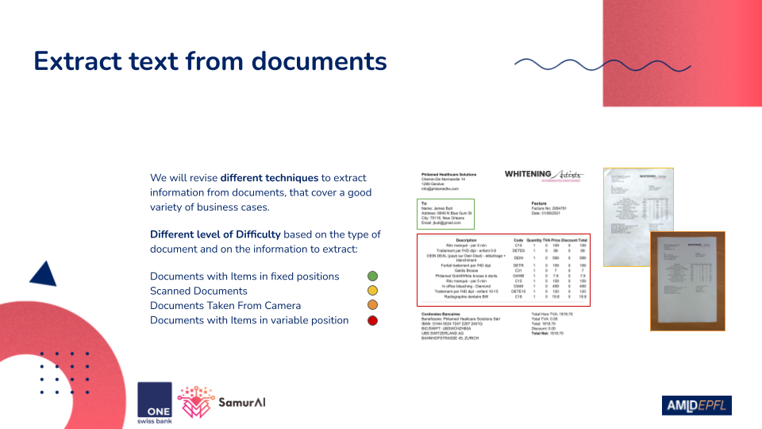
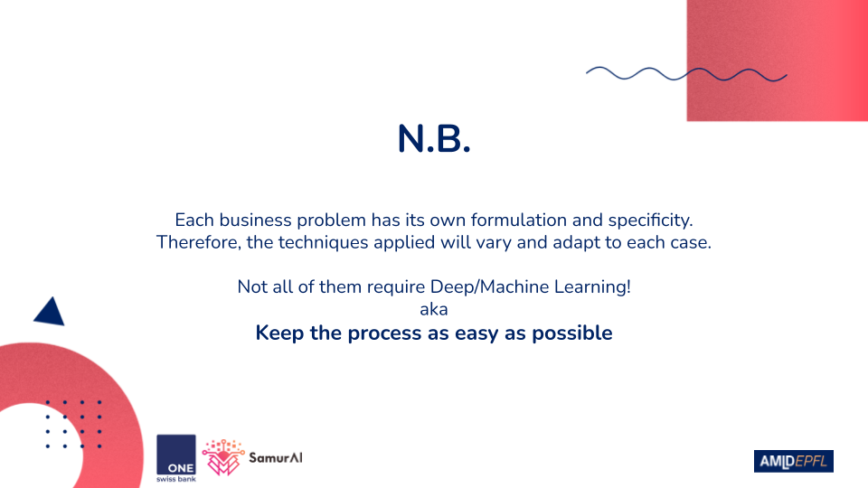
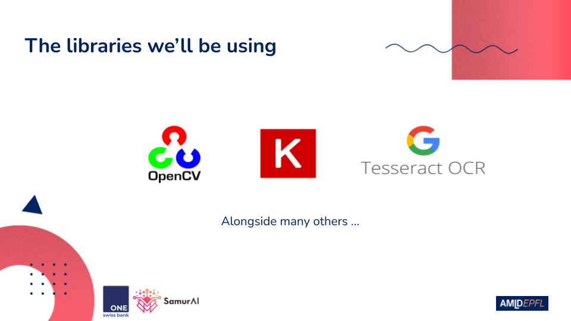
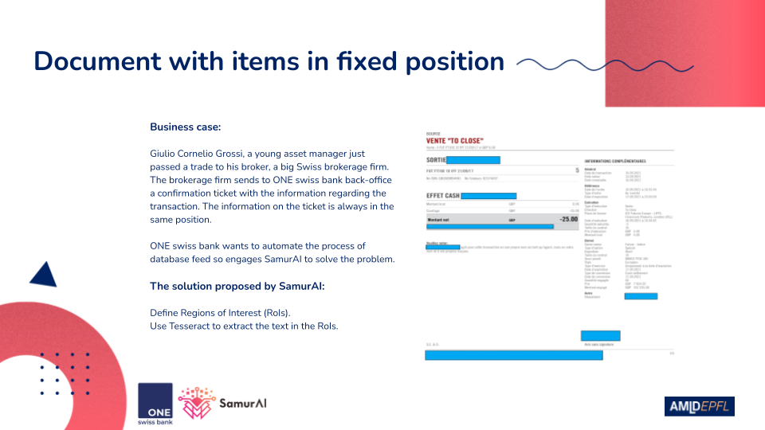
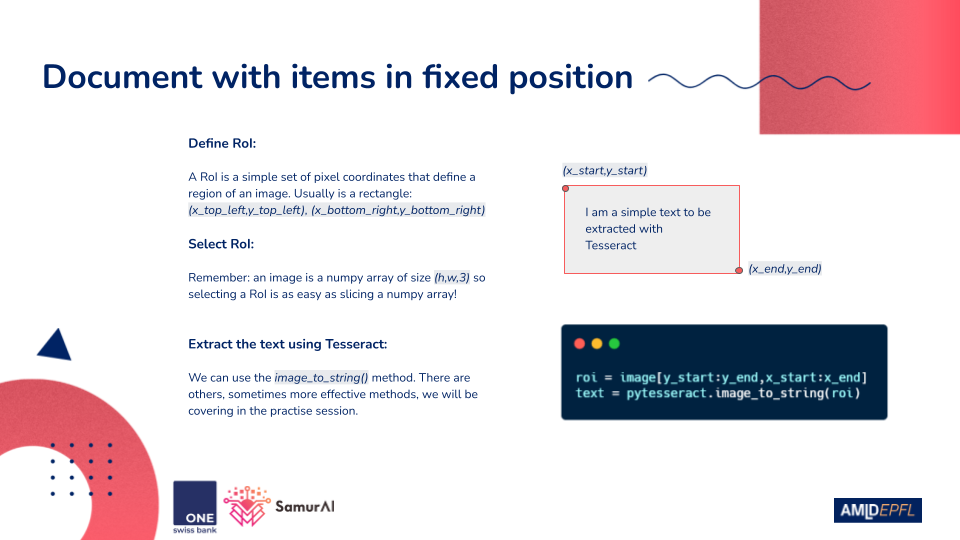
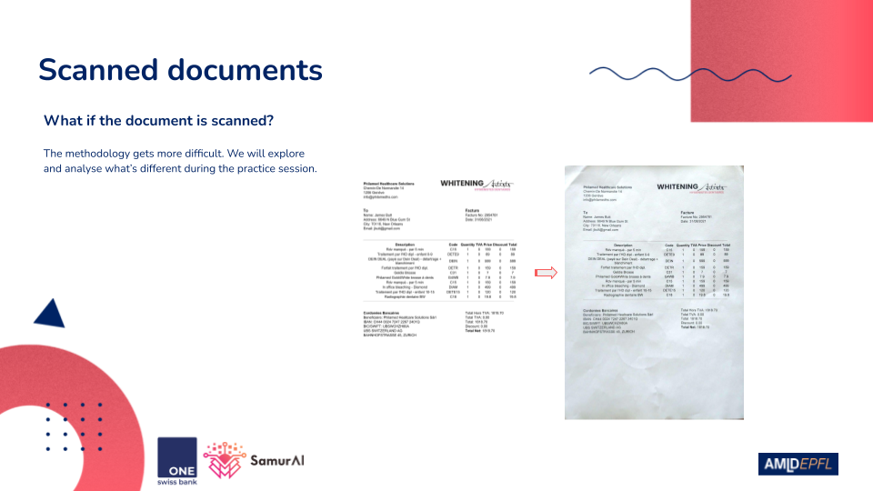
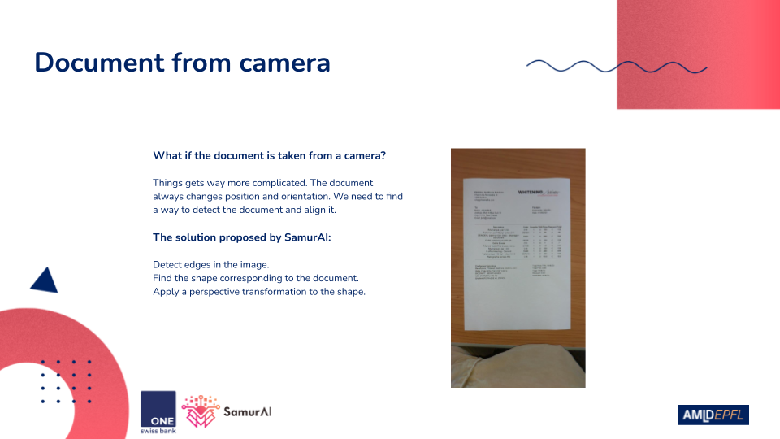
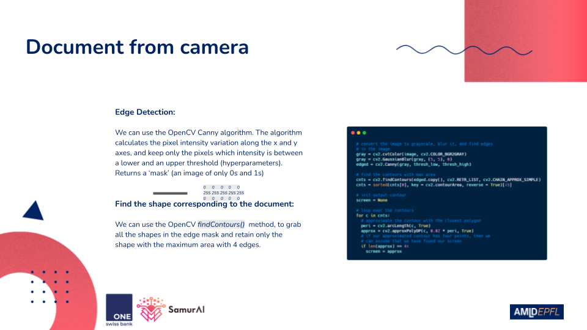
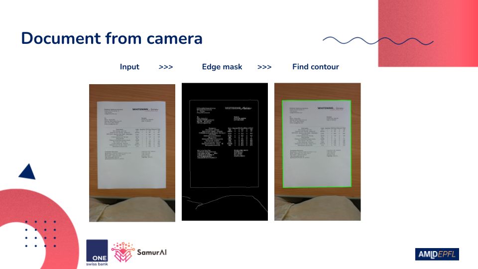
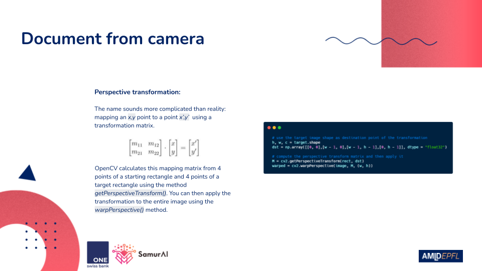
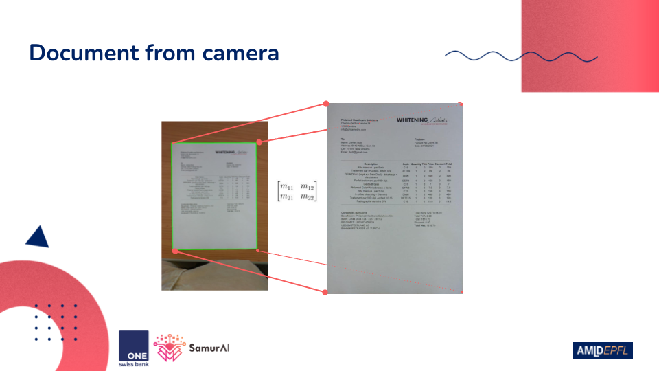
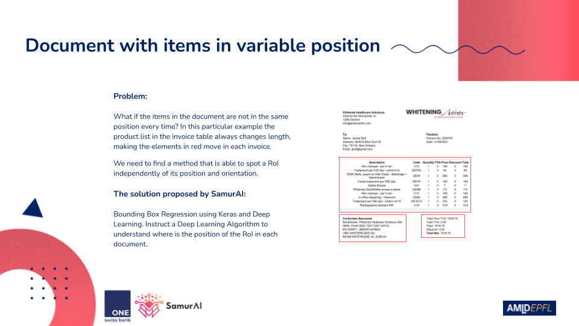
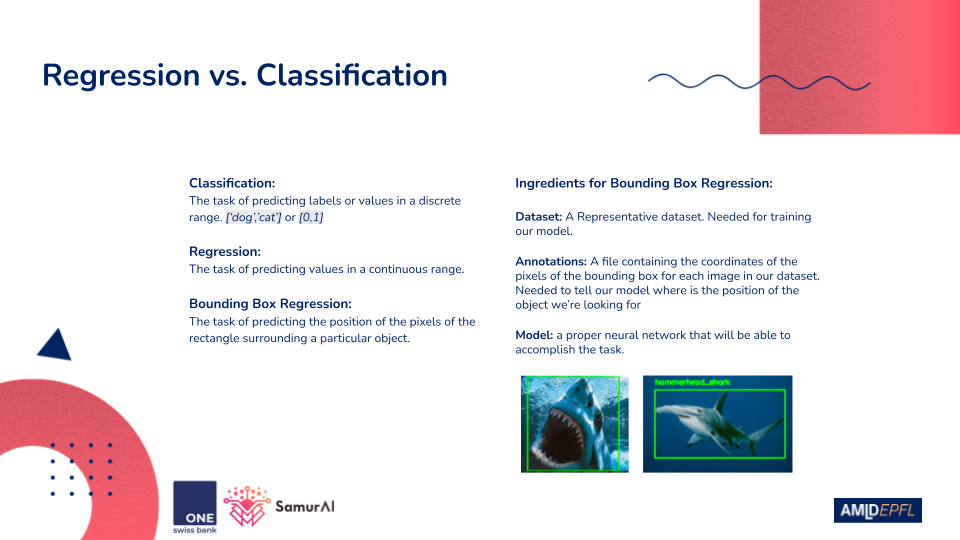
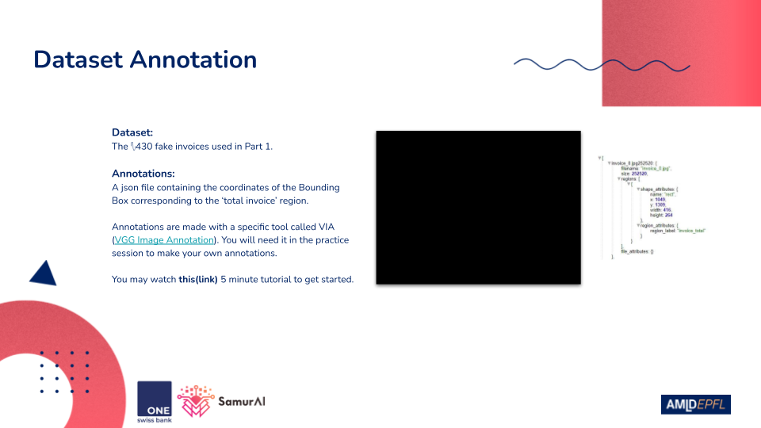
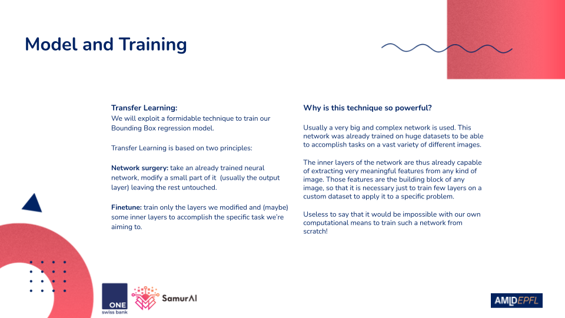
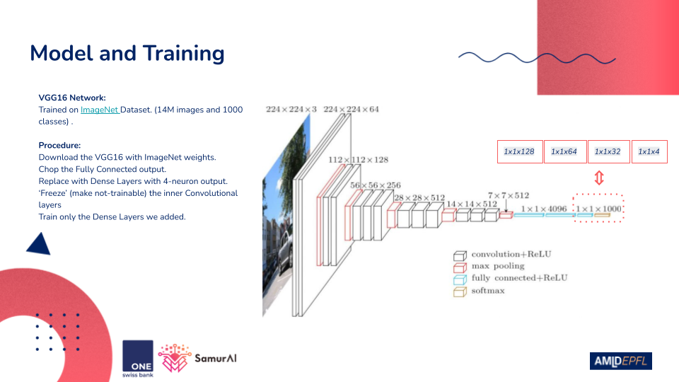
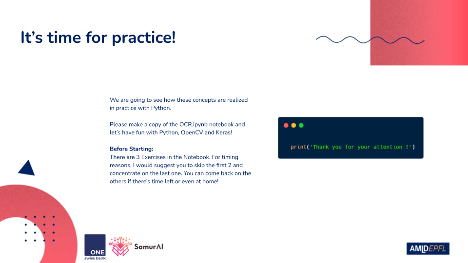
